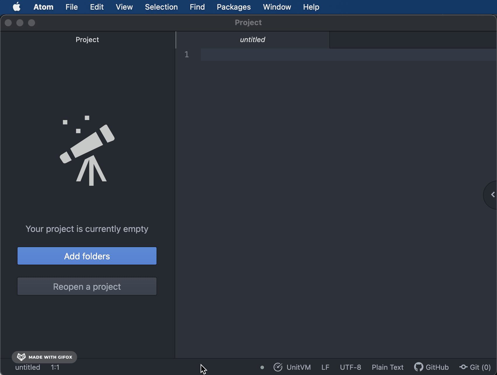

# UnitVM Application Build for Atom (via atom-build)

Uses the [atom-build](https://github.com/noseglid/atom-build) package to execute UnitVM build processes in the `Atom` text editor.

This package requires [atom-build](https://github.com/noseglid/atom-build) to be installed.

#### Requirements

You'll need to install java `OpenJDK` and `avrdude` to build and upload UnitVM application. The `avrdude` is needed to upload application in your Arduino or ATmega328p compatable board. if you have Arduino IDE installed, then most likely `avrdude` is already installed on your computer.

#### Manual Installation

Right now package is not published in Atom public registry. So,  you need to install manually from GitHub.

Run terminal window and execute the following commands:

	$ git clone https://github.com/lashad/atom-build-unitvm.git
	$ cd atom-build-unitvm
	$ apm install
	$ apm link

The `build-unitvm` package is depends on atom [build](https://atom.io/packages/build) and [busy-signal](https://atom.io/packages/busy-signal) packages.

>  Note: Atom packages are located in `~/.atom/packages` directory.

Now run Atom Text Editor.

#### Create UnitVM Project

Under the `File` menu choose `New UnitVM Project` . In the dialog prompt window create the new directory named `HelloWorld` or whatever you want. Click `Choose` button. The package will create a template project with all the necessary files in it.

Now open `HelloWorld.java` file from left tree view. 

Click on `UnitVM` button located at the bottom of the status bar. First time the package ask you to download UnitKit Framework in your computer. Click `Download` then Click `F7` and choose `UnitVM: Build Application` to build your first UnitVM application.

#### Config File

In your project directory create file `.unitvm-build.yml` and add content below:

    name: AppName
    eui64: 2C:1C:F6:D9:00:00:00:00

Where `name` is your application name and `eui64` is unique identifier of your application.
Please note: All your `.java` source files should be located under `src/main/java` directory.

You may want to upload on your device using `avrdude` . Now you can add `avrdude` configuration parameters in your build file:

    name: AppName
    eui64: 2C:1C:F6:D9:00:00:00:00
    avrdude:
      mcu: atmega328p
      bps: 57600
      port: /dev/cu.usbserial-A6007Whc

Make sure to change `port` parameter to match your systems serial port name.

